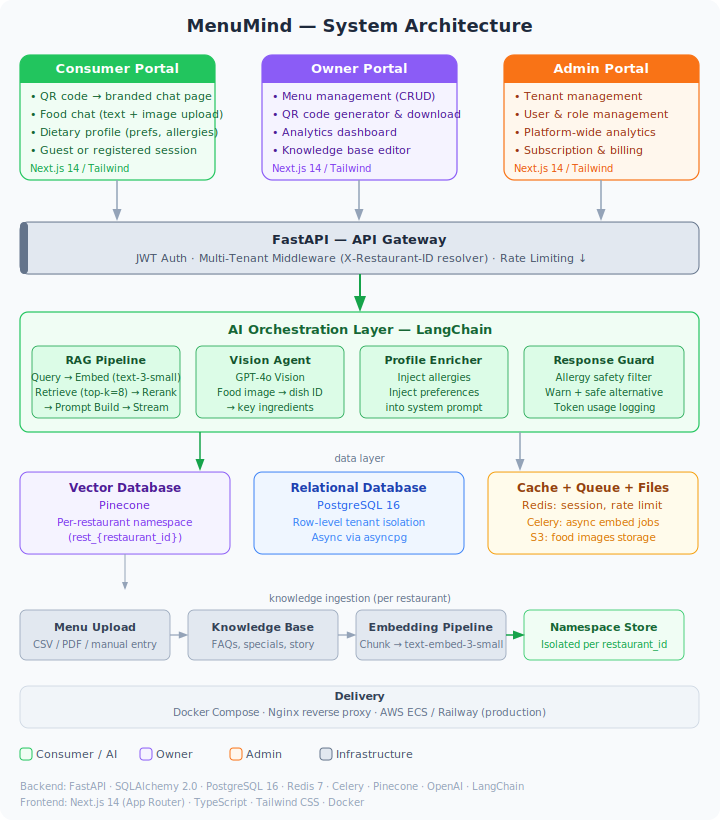

# Architecture Overview

MenuMind is a multi-tenant SaaS platform built on a modular monolith backend with a decoupled Next.js frontend.

## High-Level Design

## Key Design Decisions

### Modular Monolith
Each domain (auth, menus, chats, ai, etc.) lives in its own `app/modules/<domain>/` directory with a consistent internal structure: `router.py`, `service.py`, `model.py`, `schema.py`, `repository.py`. This keeps code organized without the complexity of microservices.

### Multi-Tenancy
Every restaurant is a tenant. All database queries, vector store lookups, and cache keys are scoped by `restaurant_id`. See [multi-tenancy.md](multi-tenancy.md) for details.

### Streaming Chat
The chat endpoint uses Server-Sent Events (SSE) to stream AI responses token-by-token to the frontend, providing a real-time conversational experience.

### Background Jobs
Celery handles async tasks: embedding menu items, processing bulk uploads, and aggregating daily stats. This keeps the API responsive.
